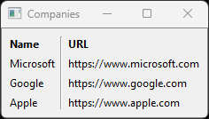

# tabler

> Convert a list of columns and rows into a GUI Table

```python
from tabler import tabler

tabler(
    [
        ['Name', 'URL'],
        ['Microsoft', 'https://www.microsoft.com'],
        ['Google', 'https://www.google.com'],
        ['Apple', 'https://www.apple.com']
    ],
    title='Companies'
)
```


